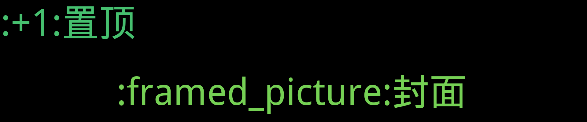

    
    
    
    
    
    
    

    

看看月亮吧 

    
## 置顶 :thumbsup: 
## 最新 :new: 

#### [Vue 数据绑定原理（一）](https://github.com/7kyun/ghiblog/issues/3) 0 :speech_balloon: 	 2022-05-09 08:10:59

:label: : [vue](https://github.com/7kyun/ghiblog/labels/vue), [源码解读](https://github.com/7kyun/ghiblog/labels/%E6%BA%90%E7%A0%81%E8%A7%A3%E8%AF%BB)

### initData
这段代码主要是初始化data中的数据，将数据进行Observer，监听数据的变化，其他的监视原理一致，这里以data为例。[源码](https://github.com/vuejs/vue/blob/2.6/src/core/instance/state.js#L112)

[更多>>>](https://github.com/7kyun/ghiblog/issues/3)

---

#### [Cover](https://github.com/7kyun/ghiblog/issues/1) 1 :speech_balloon: 	 2022-05-09 04:04:36

:label: : [:framed_picture:封面](https://github.com/7kyun/ghiblog/labels/%3Aframed_picture%3A%E5%B0%81%E9%9D%A2)

[更多>>>](https://github.com/7kyun/ghiblog/issues/1)

---

## 分类  :card_file_box: 

    

        
        
:cloud: 词云 :cloud: 点击词云展开详细分类:point_down: 

    

:+1:置顶	0:newspaper:

:framed_picture:封面	1:newspaper:

- [Cover](https://github.com/7kyun/ghiblog/issues/1)  1 :speech_balloon:  	 

vue	1:newspaper:

- [Vue 数据绑定原理（一）](https://github.com/7kyun/ghiblog/issues/3)  0 :speech_balloon:  	 

源码解读	1:newspaper:

- [Vue 数据绑定原理（一）](https://github.com/7kyun/ghiblog/issues/3)  0 :speech_balloon:  	 

    
