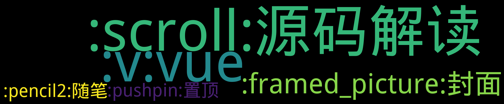

    
    
    
    
    
    
    

    

看看月亮吧 

    
## 置顶 :pushpin: 
- [为什么会出现这个博客](https://github.com/7kyun/ghiblog/issues/6)  0 :speech_balloon:  	 
## 最新 :new: 

#### [为什么会出现这个博客](https://github.com/7kyun/ghiblog/issues/6) 0 :speech_balloon: 	 2022-05-12 06:03:26

:label: : [:pushpin:置顶](https://github.com/7kyun/ghiblog/labels/%3Apushpin%3A%E7%BD%AE%E9%A1%B6), [:pencil2:随笔](https://github.com/7kyun/ghiblog/labels/%3Apencil2%3A%E9%9A%8F%E7%AC%94)

### 碎碎念
> 关于为什么现在才开始写博客，其实我更愿意把这称为笔记

之前看过一篇文章，他提到，快速改变人生的五件事情：早起，阅读，写作，运动，冥想。
想了想，我好像除了早起，阅读，运动都做到了，那我改变自己的人生岂不是就剩写作和冥想？
因此为了能快速的改变人生，我毅然决然的开启了写

[更多>>>](https://github.com/7kyun/ghiblog/issues/6)

---

#### [Vue 响应式原理（三）](https://github.com/7kyun/ghiblog/issues/5) 0 :speech_balloon: 	 2022-05-11 07:34:00

:label: : [:v:vue](https://github.com/7kyun/ghiblog/labels/%3Av%3Avue), [:scroll:源码解读](https://github.com/7kyun/ghiblog/labels/%3Ascroll%3A%E6%BA%90%E7%A0%81%E8%A7%A3%E8%AF%BB)

### defineReactive
`defineReactive` 就是定义对象上的响应性属性的方法
它是通过 `Object.defineProperty` 为数据定义上 `getter\setter` 方法
该方法会形成一个闭包，实例化一个私有的 `Dep` 实例进行该对象的依赖收集，

[更多>>>](https://github.com/7kyun/ghiblog/issues/5)

---

#### [Vue 响应式原理（二）](https://github.com/7kyun/ghiblog/issues/4) 0 :speech_balloon: 	 2022-05-09 09:29:27

:label: : [:v:vue](https://github.com/7kyun/ghiblog/labels/%3Av%3Avue), [:scroll:源码解读](https://github.com/7kyun/ghiblog/labels/%3Ascroll%3A%E6%BA%90%E7%A0%81%E8%A7%A3%E8%AF%BB)

### observe方法
这个方法就是给响应式数据添加上一个Observer实例，该实例会绑定__ob__为属性，并且不会重复绑定
[相关源码](https://github.com/vuejs/vue/blob/2.6/src/core/observer/index.js#L110)
``

[更多>>>](https://github.com/7kyun/ghiblog/issues/4)

---

#### [Vue 响应式原理（一）](https://github.com/7kyun/ghiblog/issues/3) 0 :speech_balloon: 	 2022-05-09 08:10:59

:label: : [:v:vue](https://github.com/7kyun/ghiblog/labels/%3Av%3Avue), [:scroll:源码解读](https://github.com/7kyun/ghiblog/labels/%3Ascroll%3A%E6%BA%90%E7%A0%81%E8%A7%A3%E8%AF%BB)

### initData
这段代码主要是初始化data中的数据，将数据进行Observer，监听数据的变化，其他的监视原理一致，这里以data为例
[相关源码](https://github.com/vuejs/vue/blob/2.6/src/core/instance/state.js#L1

[更多>>>](https://github.com/7kyun/ghiblog/issues/3)

---

#### [Cover](https://github.com/7kyun/ghiblog/issues/1) 1 :speech_balloon: 	 2022-05-09 04:04:36

:label: : [:framed_picture:封面](https://github.com/7kyun/ghiblog/labels/%3Aframed_picture%3A%E5%B0%81%E9%9D%A2)

[更多>>>](https://github.com/7kyun/ghiblog/issues/1)

---

## 分类  :card_file_box: 

    

        
        
:cloud: 词云 :cloud: 点击词云展开详细分类:point_down: 

    

:framed_picture:封面	1:newspaper:

- [Cover](https://github.com/7kyun/ghiblog/issues/1)  1 :speech_balloon:  	 

:pencil2:随笔	1:newspaper:

- [为什么会出现这个博客](https://github.com/7kyun/ghiblog/issues/6)  0 :speech_balloon:  	 

:pushpin:置顶	1:newspaper:

- [为什么会出现这个博客](https://github.com/7kyun/ghiblog/issues/6)  0 :speech_balloon:  	 

:scroll:源码解读	3:newspaper:

- [Vue 响应式原理（三）](https://github.com/7kyun/ghiblog/issues/5)  0 :speech_balloon:  	 
- [Vue 响应式原理（二）](https://github.com/7kyun/ghiblog/issues/4)  0 :speech_balloon:  	 
- [Vue 响应式原理（一）](https://github.com/7kyun/ghiblog/issues/3)  0 :speech_balloon:  	 

:v:vue	3:newspaper:

- [Vue 响应式原理（三）](https://github.com/7kyun/ghiblog/issues/5)  0 :speech_balloon:  	 
- [Vue 响应式原理（二）](https://github.com/7kyun/ghiblog/issues/4)  0 :speech_balloon:  	 
- [Vue 响应式原理（一）](https://github.com/7kyun/ghiblog/issues/3)  0 :speech_balloon:  	 

    
